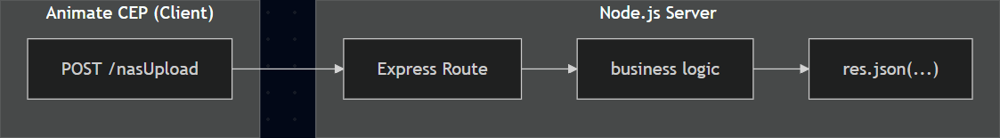

# Animate Panel

Nas에 빌드 파일을 자동으로 업로드해주는 Panel을 제작하기 위해 CEP를 활용하여 시작함

Animate CEP 패널(UI)와 로컬 Node.js 서버는 HTTP 프로토콜을 통해 데이터를 주고받습니다.

패널에서 버튼을 눌러 `fetch` 로 JSON 요청을 보내면, 서버는 Express 라우터가 이를 처리해 결과를 JSON 응답으로 반환합니다.

클라이언트는 응답을 받아 Animate 내부 스크립트를 실행합니다.



### 클라이언트 코드

```jsx
fetch('http://localhost:3200/')
	.then(res => res.text())
	.then(text => console.log(text);
```

### 서버 코드

```jsx
app.get('/', (req, res) => {
  res.send('connected');
});
```

결과 : 클라이언트 콘솔에 'connected' 출력

## 사용 방법

### 레지스트리 편집

Animate에서 Custom CEP Panel을 띄우기 위해 권한을 허용해야하는 경우도 있습니다.


`컴퓨터\HKEY_CURRENT_USER\Software\Adobe\CSXS.12` 에서 PlayerDebugMode의 값을 1로 바꿔주세요.

Animate를 재시작했는데도 뜨지 않는다면

방화벽/아웃바운드 규칙에서 Adobe Unlicensed Pop-up의 작업이 거부로 되어있진 않은지 확인해주세요.


### 파일 세팅

[https://github.com/parkyongha/Animate-Panel](https://github.com/parkyongha/Animate-Panel)

첨부한 깃 링크에서 파일을 다운받거나 clone 하신 후 

`C:\Program Files (x86)\Common Files\Adobe\CEP\extensions` 

해당 경로에 morph_panel을 통째로 넣어주시면 됩니다. 

Animate를 다시 시작해주시면 Window/Extensions 에 morph_panel이 뜨게 됩니다.


local server는 morph_panel 시작시 자동으로 켜지니 굳이 안 열어주셔도 됩니다.